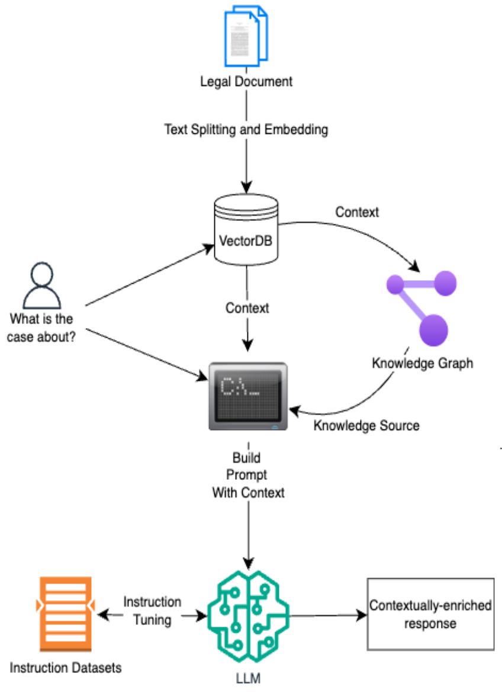

# CounselRAG - A Contextually-Aware Legal QA Platform

## Introduction

CounselRAG is a legal question-answering platform that combines Retrieval-Augmented Generation (RAG) with Knowledge Graphs to deliver accurate, context-rich responses to legislative queries. The platform explores how smaller, fine-tuned LLMs can be made more capable by integrating embeddings from user-provided legal documents (persisted in a FAISS vector store) and structured knowledge from a Neo4j-powered graph built from curated Wikipedia articles on U.S. and international law.

## Architecture

## Demo

